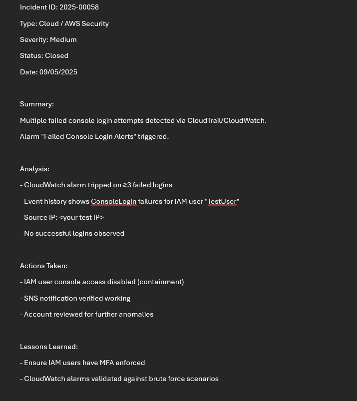

# Cloud / AWS Security Incident Response Playbook

## 1. Purpose
This playbook provides standardized detection, analysis, containment, and recovery steps for handling **suspicious AWS console login activity**.  
It is intended for Tier 1–2 SOC analysts monitoring AWS accounts with CloudTrail and CloudWatch.

---

## 2. Scope
- **Environment:** AWS account with CloudTrail, CloudWatch, and SNS configured  
- **Monitored Events:** Console login attempts (success/failure)  
- **Impact:** Brute force or unauthorized login attempts can compromise IAM users and lead to account-wide breaches

---

## 3. Detection

### 3.1 Indicators
- Multiple failed `ConsoleLogin` events in CloudTrail  
- CloudWatch alarm triggered on repeated login failures  
- SNS email alert sent to security contacts  

### 3.2 Evidence

**CloudWatch metric showing failed console logins:**  

**CloudWatch alarm in `In Alarm` state:**  

**SNS notification email (alert details):**  

**CloudTrail event history showing failed `ConsoleLogin` attempts:**  

---

## 4. Containment

Containment was performed by disabling console access for the suspicious IAM user `test.user`.  
This prevents further login attempts from that account while investigation continues.

**IAM user console access disabled:**  

---

## 5. Recovery

- Verified no successful logins occurred during the brute force attempts  
- Reviewed other IAM users and roles for suspicious activity  
- Enforced **MFA** on IAM users to prevent recurrence  
- Re-enabled console access only after validation and security hardening  

---

## 6. Lessons Learned

- Ensure all IAM users have **MFA enforced**  
- CloudWatch alarms must be tuned to detect brute force scenarios without creating noise  
- Regularly review IAM user policies and rotate access keys  
- Educate users on monitoring AWS SNS security alerts in real time  

---

## 7. References

- [NIST 800-61: Computer Security Incident Handling Guide](https://nvlpubs.nist.gov/nistpubs/SpecialPublications/NIST.SP.800-61r2.pdf)  
- [AWS CloudTrail Documentation](https://docs.aws.amazon.com/awscloudtrail/latest/userguide/cloudtrail-user-guide.html)  
- [AWS CloudWatch Documentation](https://docs.aws.amazon.com/AmazonCloudWatch/latest/monitoring/WhatIsCloudWatch.html)  
- [AWS IAM Security Best Practices](https://docs.aws.amazon.com/IAM/latest/UserGuide/best-practices.html)  

---

**SOC Ticket (example):**  

