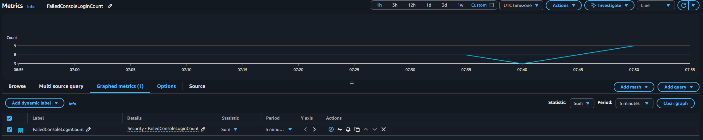
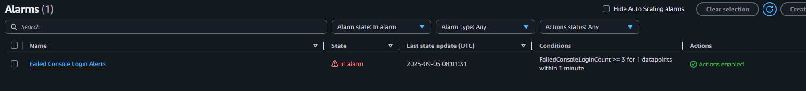
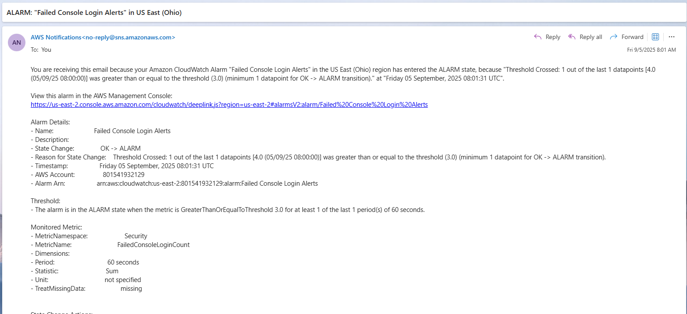
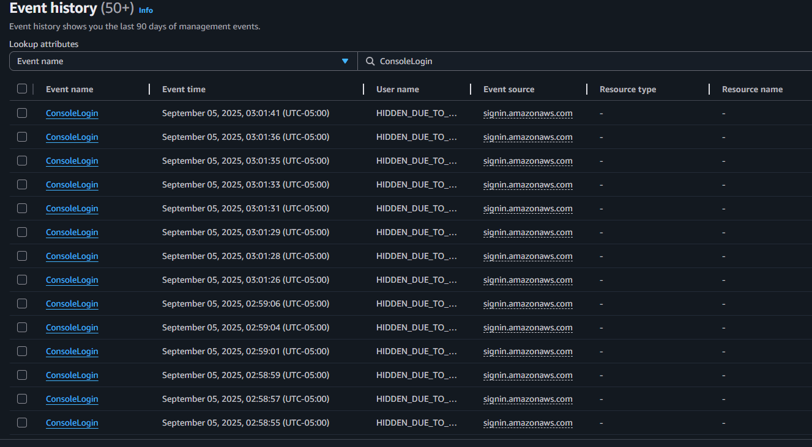
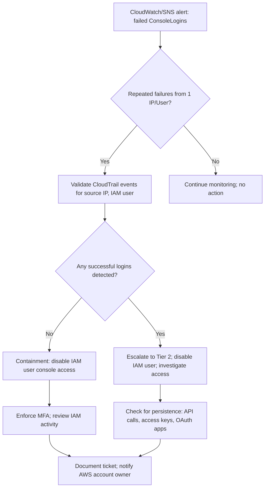
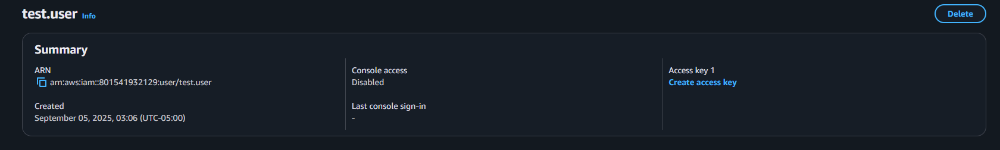

# Cloud / AWS Security Incident Response Playbook

## 1. Purpose
This playbook provides standardized detection, analysis, containment, and recovery steps for handling **suspicious AWS console login activity**.  
It is intended for Tier 1–2 SOC analysts monitoring AWS accounts with CloudTrail and CloudWatch.

---

## 2. Scope
- **Environment:** AWS account with CloudTrail, CloudWatch, and SNS configured  
- **Monitored Events:** Console login attempts (success/failure)  
- **Potential Impact:** Brute force or unauthorized login attempts can compromise IAM users and lead to account-wide breaches  

---

## 3. Detection

### 3.1 Indicators
- Multiple failed `ConsoleLogin` events in CloudTrail  
- CloudWatch alarm triggered on repeated login failures  
- SNS email alert sent to security contacts  

### 3.2 Evidence (Screenshots)
- **CloudWatch metric showing failed console logins:**  
  
- **CloudWatch alarm in `In Alarm` state:**  
  
- **SNS notification email (alert details):**  
  
- **CloudTrail event history showing failed `ConsoleLogin` attempts:**  
  

---

## 4. Analyst Decision Aid (Tier-1 Flow)

## 5. Containment

- Disabled console access for suspicious IAM user `test.user` to block login attempts  
    
- Reviewed CloudTrail logs for other suspicious activity tied to the same IP  
- If compromise suspected: rotate access keys and enforce credential reset  

---

## 6. Recovery

- Verified no successful logins occurred during brute force attempts  
- Reviewed all IAM users and roles for unusual API activity  
- Enforced **MFA** across IAM users to prevent recurrence  
- Re-enabled console access only after account hardening and validation  

---

## 7. Timeline & Escalation (Example from this incident)

**Timeline**  
- 02:58:55 – First failed `ConsoleLogin` attempt recorded in CloudTrail  
- 02:59:01 – Additional failed logins observed  
- 02:59:06 – Spike continues, multiple failures within seconds  
- 03:01:26 – Final failed login attempt in observed sequence  
- 03:01:29 – CloudWatch alarm triggered  
- 03:01:36 – SNS alert delivered to security contacts  
- 03:05 – Tier 1 confirmed failed logins and escalated  
- 03:10 – Tier 2 disabled IAM user console access  
- 03:25 – IAMs reviewed; MFA enforced; system validated  
- 03:30 – Ticket closed; incident documented  

**Escalation Path**  
- **Tier 1:** Monitor SNS alerts, validate CloudTrail events, confirm brute force pattern  
- **Tier 2:** Disable IAM access, rotate creds, enforce MFA, review IAM roles  
- **Tier 3 (if needed):** Forensics, IOC enrichment, coordinate with AWS support  

---

## 8. Metrics

- **MTTD (Mean Time to Detect):** ~2 minutes (failed login attempts → CloudWatch/SNS alert)  
- **MTTR (Mean Time to Respond):** ~25 minutes (alert → IAM disabled, MFA enforced, recovery validated)  
- **Impacted IAM Users:** 1 (`test.user`)  
- **Containment Success:** 100% (access disabled, no compromise confirmed)  

---

## 9. Lessons Learned

**Technical**  
- Enforce **MFA** on all IAM accounts to prevent brute force success  
- Tune CloudWatch alarms to balance sensitivity vs. noise  
- Rotate access keys regularly and monitor IAM usage logs  

**Process**  
- Ensure analysts validate CloudTrail events before containment  
- Standardize immediate MFA enforcement after suspicious login attempts  

**User Awareness**  
- Cloud administrators must monitor and respond to **SNS security alerts promptly**  

---

## 10. User Communication (Cloud Admin Notification)

**Subject:** Security Notice – Suspicious AWS Console Login Attempts  

Hello [Cloud Admin],  

The SOC detected suspicious AWS console login activity targeting IAM user **test.user** on **September 2, 2025**. Multiple failed login attempts were observed, and an automated CloudWatch/SNS alert was triggered.  

**Actions Taken:**  
- IAM console access for `test.user` was disabled  
- MFA enforcement applied across IAM users  
- Account activity reviewed for anomalies  

**Next Steps for You:**  
- Validate IAM user activity in your applications  
- Ensure MFA is enabled for any remaining IAMs you manage  
- Report any unusual AWS activity to IT Security immediately  

— IT Security Team  

---

## 11. Knowledge Base Entry (Training Artifact)

**Incident Name:** AWS Suspicious Console Login – Sept 2025  
**Target:** IAM user `test.user`  
**Source:** Multiple failed login attempts (CloudTrail/CloudWatch)  

### Key Indicators
- CloudTrail: multiple `ConsoleLogin` failures  
- CloudWatch alarm → SNS email notification  
- Source IP tied to repeated brute force attempts  

### Actions That Worked
- Disabled IAM user console access  
- Enforced MFA across IAMs  
- Validated no successful compromise  

### Quick Lessons Learned
- MFA is critical to prevent brute force success  
- Analysts must validate CloudTrail logs before containment  
- IAM reviews after incident should be standard  

**Reference Ticket:** SOC-2025-09-02-001  

---

## 12. SOC Ticket

**Incident ID:** SOC-2025-09-02-001  
**Type:** Cloud – Suspicious AWS Console Login  
**Severity:** Medium **Status:** Closed  
**Opened:** 2025-09-02 03:01 **Closed:** 2025-09-02 03:30  
**Handler:** Jacob Taylor (Tier 1 SOC Analyst)  

**Summary**  
CloudWatch/CloudTrail detected multiple failed `ConsoleLogin` events for IAM user `test.user`. SOC analysts confirmed the brute force pattern, disabled console access, and enforced MFA across IAMs.  

**Indicators**  
- Failed `ConsoleLogin` attempts in CloudTrail  
- CloudWatch alarm triggered  
- SNS alert email received  

**Timeline**  
02:58:55 failed login → 02:59:06 multiple failures → 03:01:29 alarm → 03:01:36 SNS alert → 03:05 validation → 03:10 IAM disabled → 03:25 MFA enforced → 03:30 closure  
**MTTD:** ~2m **MTTR:** ~25m  

**Impact**  
- IAM user `test.user` affected  
- No successful logins detected  
- No sensitive AWS resources compromised  

**Containment Actions**  
- Disabled IAM user console access  
- Rotated credentials where applicable  
- Enforced MFA  

**Recovery Actions**  
- Reviewed IAM activity across account  
- Confirmed no persistence or unauthorized access  
- Re-enabled access after hardening  

**Final Status:** Incident contained; no compromise confirmed.  

---

## 13. Executive Summary (Leadership)

On **September 2, 2025**, the SOC investigated suspicious AWS console login attempts targeting IAM user **test.user**. Between **02:58–03:01 (UTC-05:00)**, CloudTrail recorded a burst of failed `ConsoleLogin` events, which triggered a CloudWatch alarm and an SNS alert to the security team. Immediate containment actions included disabling console access for the affected IAM user and enforcing MFA across accounts. Recovery steps included reviewing IAM activity, validating no successful logins occurred, and confirming that AWS resources remained secure.  

The incident was contained with no evidence of compromise. **Business impact was minimal**, and no sensitive data or systems were affected. The rapid reporting and automated alerting reduced time-to-detection, demonstrating the effectiveness of monitoring and response controls. Lessons learned highlight the need for **mandatory MFA enforcement**, continued tuning of CloudWatch alarms, and proactive review of CloudTrail activity. This incident reinforces the SOC’s ability to quickly detect and contain brute force attempts in the cloud while minimizing risk to the organization.
 
---

## 14. References
- [NIST 800-61: Computer Security Incident Handling Guide](https://nvlpubs.nist.gov/nistpubs/SpecialPublications/NIST.SP.800-61r2.pdf)  
- [AWS CloudTrail Documentation](https://docs.aws.amazon.com/awscloudtrail/latest/userguide/cloudtrail-user-guide.html)  
- [AWS CloudWatch Documentation](https://docs.aws.amazon.com/AmazonCloudWatch/latest/monitoring/WhatIsCloudWatch.html)  
- [AWS IAM Security Best Practices](https://docs.aws.amazon.com/IAM/latest/UserGuide/best-practices.html)  
