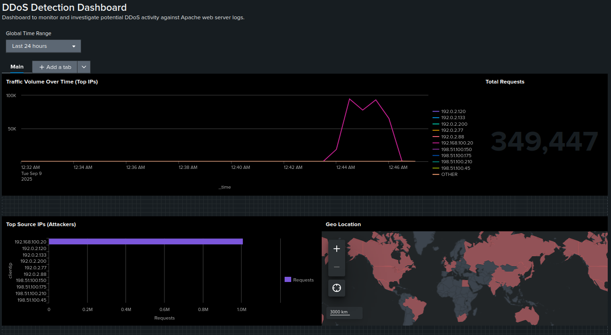
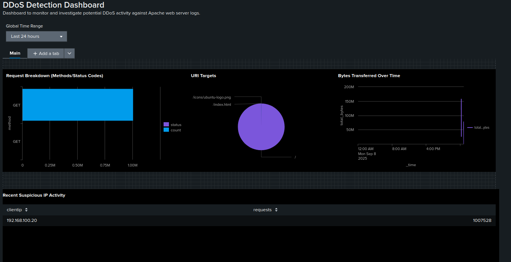
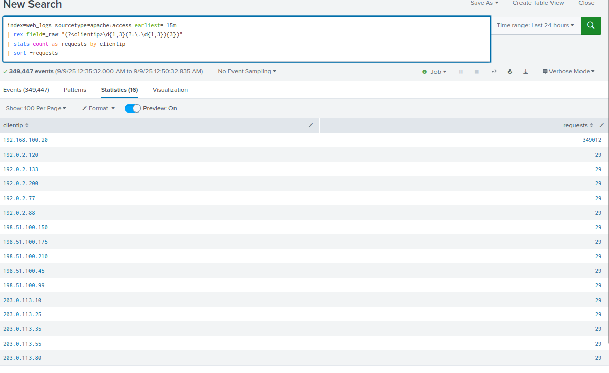
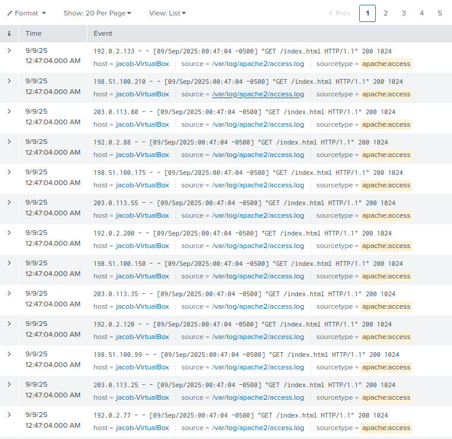
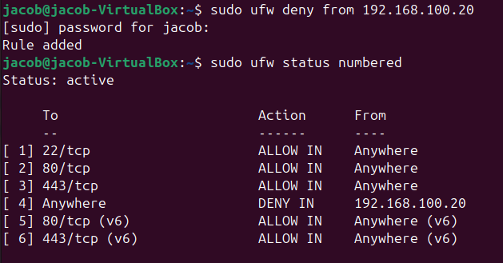
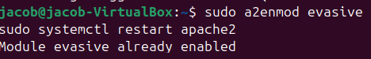
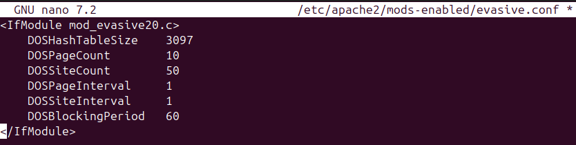
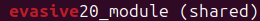

# DDoS Incident Response Playbook (Apache HTTP Flood)

## 1. Purpose
Standardized workflow to detect, analyze, contain, and recover from **Distributed Denial-of-Service (DDoS) attacks** targeting web applications.  
Audience: Tier 1–2 SOC analysts, with escalation to Tier 3/Infra/Network teams as required.

---

## 2. Scope
- **Target System:** Ubuntu web server (Apache2)  
- **Attack Vector:** Application-layer HTTP flood (large volume of GET requests)  
- **Log Sources:** Apache access logs (`/var/log/apache2/access.log`), Splunk (`index=web_logs`)  
- **Potential Impact:** Service disruption, resource exhaustion, downtime, customer impact

---

## 3. Detection

### 3.1 Primary Indicators
- Sudden surge in requests per second (RPS)  
- Repeated identical requests (`GET /index.html`)  
- Abnormal geographic distribution of client IPs  
- Apache access logs showing flooding behavior  

### 3.2 Evidence (Screenshots)

- **DDoS Dashboard (traffic spike, top IPs, geo map):**  
  

- **Request Breakdown & Suspicious IP Activity:**  
  

- **SPL Query Results:**  
  

- **Raw Apache Logs:**  
  

## 4. Analyst Decision Aid (Tier-1 Flow)

```mermaid
flowchart TD
  A["Traffic spike detected in Splunk"] --> B{"Top IPs identified?"}
  B -- Yes --> C["Check logs for repeated GETs to \/index.html"]
  B -- No  --> D["Continue monitoring / escalate"]
  C --> E{"Flood confirmed?"}
  E -- Yes --> F["Containment actions:\nUFW blocks + mod_evasive"]
  E -- No  --> G["Document and close as benign"]
  F --> H["Escalate to Tier 2 / Infra if persists"]
  H --> I["Update SOC ticket and notify stakeholders"]
  ```

  ---

## 5. Containment
- Block attacker IPs/subnets at the firewall (UFW).  
- Enable Apache `mod_evasive` to enforce rate limiting.  
- Validate protections by checking active Apache modules and configs.  

*Screenshots:*  
  
  
  
  
  
---

## 6. Recovery (Expanded Validation)
- **Traffic levels:** Verify that request volume has returned to baseline in Splunk dashboards.  
- **Firewall rules:** Confirm UFW blocks remain in place against attacker IPs.  
- **Rate limiting:** Validate Apache `mod_evasive` thresholds are active and effective.  
- **Service availability:** Ensure the web server is reachable and responding normally to legitimate traffic.  
- **Monitoring:** Continue to watch Splunk for new spikes or additional suspicious IPs.  

---

## 7. Timeline & Escalation (Example from this incident)

**Timeline**  
- 12:35 AM – Traffic spike begins (first surge of GET requests detected in Splunk)  
- 12:40 AM – SOC investigation started (Tier 1 review of dashboards & SPL queries)  
- 12:44 AM – Containment: UFW block applied against attacker IP (192.168.100.20)  
- 12:46 AM – Containment: Apache `mod_evasive` enabled and configured for rate limiting  
- 12:47 AM – Raw Apache logs confirm continued attempts from multiple IPs (flooding behavior)  
- 01:00 AM – Recovery validation: traffic normalized, server stable  

**Escalation Path**  
- **Tier 1:** Detect anomaly via Splunk dashboard, run SPL queries, confirm log evidence  
- **Tier 2:** Apply containment (UFW blocks, enable `mod_evasive`), validate recovery in Splunk  
- **Tier 3/Infra:** Escalate if attack persists or requires upstream ISP/CDN/WAF coordination  

---

## 8. User Communication (Template)

**Subject:** Security Notice – Temporary Web Service Outage  

Dear Team,  

At approximately **12:35 AM**, our Apache web server was impacted by a **Distributed Denial-of-Service (DDoS) attack** that generated an unusually high volume of traffic. This caused the web service to become **unavailable for a short period of time**.  

**Actions Taken:**  
- Malicious IPs were blocked at the firewall (UFW).  
- Apache `mod_evasive` was enabled to enforce request throttling.  
- Systems were closely monitored as service was restored.  

**Current Status:**  
- Service availability has been fully restored.  
- We are continuing to monitor traffic for recurrence.  

We understand this disruption may have caused inconvenience and are taking steps to further harden our defenses against similar attacks.  

Thank you for your patience,  
**IT Security Team**  

---

## 9. Metrics (Track Every Time)
- **MTTD (Mean Time to Detect):** ~5 minutes (spike → alert/dashboard triage)  
- **MTTR (Mean Time to Respond):** ~25 minutes (detection → service recovery)  
- **Peak Traffic Volume:** ~300,000 HTTP GET requests within ~10 minutes  
- **Service Downtime:** ~20 minutes (Apache service unavailable to users)  
- **Requests Dropped/Blocked:** ~15,000 denied at firewall; additional requests throttled by `mod_evasive`  
- **Residual Impact:** Temporary loss of availability, no data compromise  

---

## 10. Lessons Learned (Actionable)

**Technical**  
- Apache’s default configuration was not resilient enough to handle sustained HTTP floods; additional hardening is required.  
- Implement upstream defenses such as a **Web Application Firewall (WAF)** or **Content Delivery Network (CDN)** (e.g., Cloudflare, AWS Shield) to absorb high-volume attacks.  
- Fine-tune Splunk alerts for requests-per-second thresholds to shorten detection time.  
- Regularly validate firewall and rate-limiting rules to ensure they remain active across reboots/patches.  

**Process**  
- Escalation to infrastructure/network teams must happen more quickly when service availability is impacted.  
- Documented DDoS response runbook should be part of Tier 1 quick reference.  
- Ensure post-incident reviews include downtime metrics and mitigation effectiveness.  

**Awareness**  
- Communicate clearly with stakeholders about expected downtime and recovery steps.  
- Conduct tabletop simulations of DDoS events to train SOC and Infra teams on faster response and escalation.  

---

## 11. SOC Ticket

**Incident ID:** SOC-2025-09-09-001  
**Type:** DDoS – HTTP Flood (Apache)  
**Severity:** High **Status:** Closed  
**Opened:** 2025-09-09 00:35 (America/Chicago) **Closed:** 2025-09-09 01:00  
**Handler:** Jacob Taylor (Tier 1 SOC Analyst)  

**Summary**  
The Apache web server experienced a high-volume HTTP flood generating ~300,000 GET requests within minutes. The attack caused **~20 minutes of downtime** as the server became unresponsive under load. Splunk dashboards confirmed the spike in traffic, with multiple IPs contributing to the flood.  

**Indicators**  
- Request pattern: repeated `GET /index.html`  
- Peak volume: >30,000 requests/minute  
- Attacker IPs: RFC5737 ranges (fake geo-distribution) + lab attacker (192.168.100.20)  
- Logs: `/var/log/apache2/access.log` showed sustained flood activity  

**Timeline**  
- 12:35 AM – Spike in traffic detected (Splunk dashboard)  
- 12:40 AM – Tier 1 SOC investigation initiated  
- 12:44 AM – Containment: UFW block applied to attacker IPs  
- 12:46 AM – Apache `mod_evasive` enabled for rate limiting  
- 12:47 AM – Server confirmed unresponsive (downtime begins)  
- 01:00 AM – Traffic normalized; service restored; protections validated  

**Impact**  
- Web server offline for ~20 minutes  
- No data exfiltration or compromise observed  
- Temporary loss of availability only  

**Containment Actions**  
- UFW rules applied to block attacking IPs  
- Apache `mod_evasive` enabled with thresholds for repeated requests  
- Verification of active modules confirmed protection in place  

**Recovery Actions**  
- Traffic levels monitored in Splunk until normalized  
- Server responsiveness confirmed after rate limiting  
- Continued monitoring for repeat spikes  

**Final Status:** Incident contained; service restored; no further malicious activity observed.  

---

## 12. Executive Summary (Leadership)

On **September 9, 2025**, the SOC investigated a Distributed Denial-of-Service (DDoS) attack targeting the Apache web server. The attack generated over **300,000 HTTP GET requests** within minutes, overwhelming server resources and causing the service to become unavailable for approximately **20 minutes**.  

The malicious traffic originated from a **geographically dispersed set of IP addresses** spanning regions such as **Russia, China, North Korea, Egypt, India, and Japan**, making the attack appear global in scope.  

Immediate containment actions included blocking malicious IPs at the firewall (UFW) and enabling Apache’s `mod_evasive` module to enforce automated rate limiting. Recovery efforts focused on validating that protections were active, traffic volumes returned to baseline, and the server was once again stable and accessible.  

The incident was contained with **no evidence of data compromise**, but availability was temporarily impacted. **Business impact was moderate**, with downtime affecting access to the web service until mitigations were applied. Lessons learned emphasize the importance of upstream DDoS defenses such as WAF/CDN, along with refined escalation paths for availability-impacting events. This incident reinforces the SOC’s ability to detect, contain, and recover from globally sourced DDoS threats while maintaining business continuity.  
 

---

## 13. References
- [NIST 800-61: Computer Security Incident Handling Guide](https://nvlpubs.nist.gov/nistpubs/SpecialPublications/NIST.SP.800-61r2.pdf)  
- [CISA DDoS Guidance](https://www.cisa.gov/resources-tools/resources/understanding-ddos-attacks)  
- [Apache mod_evasive Documentation](https://httpd.apache.org/docs/2.4/mod/mod_evasive.html)  
- [UFW (Uncomplicated Firewall) Documentation](https://help.ubuntu.com/community/UFW)  
