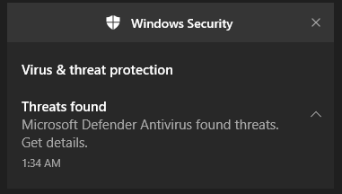
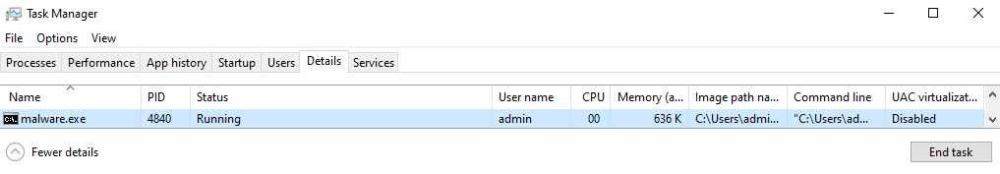
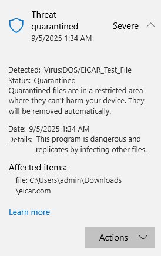
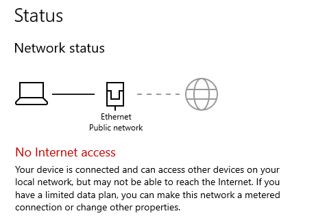
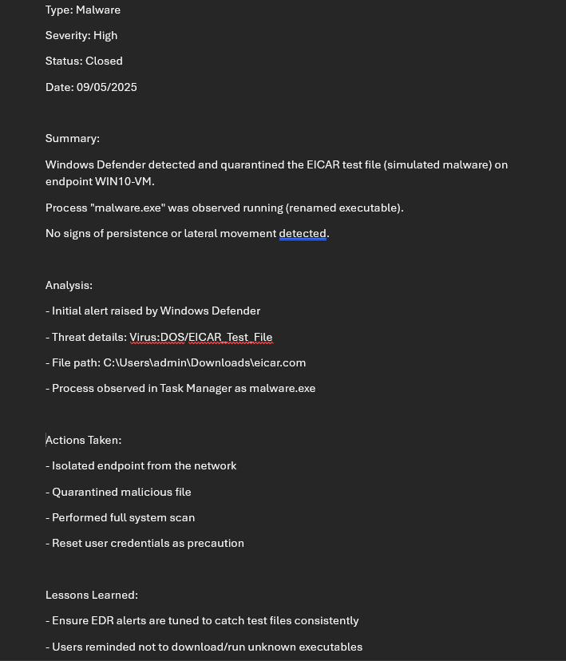

# Malware Incident Response Playbook

## 1. Purpose
This playbook provides standardized detection, analysis, containment, and recovery steps for handling **malware infections** on Windows endpoints.  
It is intended for Tier 1–2 SOC analysts monitoring Windows 10 systems.

---

## 2. Scope
- **Target System:** Windows 10 VM (WIN10-VM)  
- **Attack Vector:** Download and execution of EICAR test file (simulated malware)  
- **Detection Tool:** Windows Defender AV/EDR  
- **Impact:** Malware execution can lead to system compromise, persistence, and lateral movement if not contained

---

## 3. Detection

### 3.1 Indicators
- Windows Defender alert indicating malware detection  
- Suspicious process observed in Task Manager  
- Threat quarantined in AV logs

### 3.2 Evidence

**Initial EDR/AV alert raised by Windows Defender:**

**Suspicious process observed on endpoint (renamed executable):**

**Detection details from Windows Defender Protection History:**

---

## 4. Containment

Endpoint was isolated from the network to prevent further spread and command-and-control communication:

Defender automatically quarantined the malicious file (`C:\Users\admin\Downloads\eicar.com`).  
Manual review confirmed no persistence mechanisms or additional malware artifacts.

---

## 5. Recovery

- Verified Defender quarantine completed successfully  
- Performed full system scan with AV/EDR  
- Reset impacted user account credentials  
- Reconnected system to the network only after verifying it was clean  

---

## 6. Lessons Learned

- Ensure EDR alerts are tuned to catch test files and real malware consistently  
- Analysts should confirm quarantine actions and validate system health post-incident  
- Users must be reminded not to download or execute unknown files  
- Consider additional endpoint hardening (application whitelisting, blocking executables from Downloads folder)

---

## 7. References

- [NIST 800-61: Computer Security Incident Handling Guide](https://nvlpubs.nist.gov/nistpubs/SpecialPublications/NIST.SP.800-61r2.pdf)  
- [Microsoft Docs: Windows Security Baselines](https://learn.microsoft.com/en-us/windows/security/threat-protection/)  
- [EICAR Test File Information](https://www.eicar.org/download-anti-malware-testfile/)  

---

**SOC Ticket (example):**

