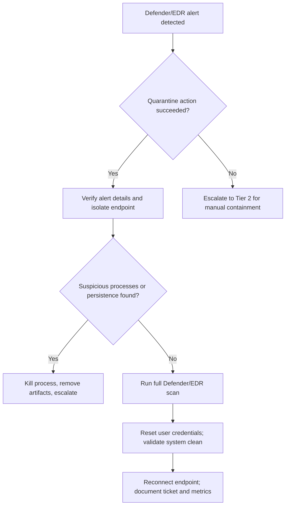

# Malware Incident Response Playbook

## 1. Purpose
This playbook provides standardized detection, analysis, containment, and recovery steps for handling **malware infections** on Windows endpoints.  
It is intended for Tier 1–2 SOC analysts monitoring Windows 10 systems.

---

## 2. Scope
- **Target System:** Windows 10 VM (WIN10-VM)  
- **Attack Vector:** Download and execution of EICAR test file (simulated malware)  
- **Detection Tool:** Windows Defender AV/EDR  
- **Potential Impact:** Malware execution can lead to system compromise, persistence, and lateral movement if not contained  

---

## 3. Detection

### 3.1 Indicators
- Windows Defender alert indicating malware detection  
- Suspicious process observed in Task Manager  
- Threat quarantined in AV logs  

### 3.2 Evidence (Screenshots)
- **Initial EDR/AV alert raised by Windows Defender:**  
  
- **Suspicious process observed on endpoint (renamed executable):**  
  
- **Detection details from Windows Defender Protection History:**  
  

---

## 4. Analyst Decision Aid (Tier-1 Flow)

## 5. Containment

- Isolated endpoint from the network to prevent further spread and C2 communication:  
    
- Defender automatically quarantined malicious file:  
  `C:\Users\admin\Downloads\eicar.com`  
- Manual review confirmed **no persistence mechanisms or additional artifacts**  

---

## 6. Recovery

- Verified Defender quarantine completed successfully  
- Performed full system scan with AV/EDR  
- Reset impacted user account credentials  
- Reconnected system to the network only after verifying it was clean  

---

## 7. Timeline & Escalation (Example from this incident)

**Timeline**  
- 14:05 – User downloads suspicious file (EICAR test)  
- 14:07 – Defender detects and quarantines file  
- 14:08 – SOC receives EDR alert  
- 14:12 – Tier 1 confirms alert and isolates endpoint  
- 14:25 – Tier 2 verifies quarantine and runs full system scan  
- 14:40 – User credentials reset; system cleared for rejoin  
- 14:50 – Incident closed and ticket updated  

**Escalation Path**  
- **Tier 1:** Validate Defender alert, confirm quarantine, isolate endpoint  
- **Tier 2:** Run full scan, check persistence, validate recovery, reset creds  
- **Tier 3 (if needed):** Malware forensics, IOC extraction, threat intel sharing  

---

## 8. Metrics

- **MTTD (Mean Time to Detect):** ~2 minutes (download → Defender alert)  
- **MTTR (Mean Time to Respond):** ~45 minutes (alert → system verified clean and reconnected)  
- **Impacted Users:** 1 (test endpoint)  
- **Containment Success:** 100% (Defender + isolation)  

---

## 9. Lessons Learned

**Technical**  
- Ensure EDR rules are tuned to consistently detect test files and real malware  
- Confirm quarantine actions and validate system health post-incident  

**User Awareness**  
- Users must be reminded not to download or execute unknown files  

**Process**  
- Add proactive hunts for persistence (scheduled tasks, registry, startup folders)  
- Consider additional endpoint hardening (application whitelisting, block executables from Downloads folder)  

---

## 10. User Communication (Endpoint Owner Notification)

**Subject:** Security Notice – Malware Detected and Removed  

Hello [User],  

The SOC identified and contained a malware infection on your workstation (**WIN10-VM**) on **September 1, 2025**. The malicious file was automatically quarantined by Windows Defender, and the endpoint was isolated during investigation.  

**Actions Taken:**  
- Malware quarantined by Defender  
- Endpoint isolated, scanned, and verified clean  
- Your account credentials have been reset  

**Next Steps for You:**  
- Please log in with your new credentials  
- Do not download or run files from untrusted sources  
- If you experience issues, contact the IT Security team immediately  

— IT Security Team  

---

## 11. Knowledge Base Entry (Training Artifact)

**Incident Name:** Malware – EICAR Test File (Sept 2025)  
**Target:** Windows 10 VM (WIN10-VM)  
**Source:** User download of EICAR test file  

### Key Indicators
- Defender/EDR alert: Malware detected & quarantined  
- Suspicious process observed in Task Manager  
- Quarantine logs in Defender Protection History  

### Actions That Worked
- Endpoint isolation prevented spread  
- Defender quarantine removed malicious file  
- Full scan validated system clean  
- User credentials reset  

### Quick Lessons Learned
- AV/EDR auto-quarantine effective; must always validate manually  
- Users need awareness reminders about untrusted downloads  
- Post-incident scans & credential resets should be standard  

**Reference Ticket:** SOC-2025-09-01-001  

---

## 12. SOC Ticket

**Incident ID:** SOC-2025-09-01-001  
**Type:** Malware – EICAR Test File  
**Severity:** Medium **Status:** Closed  
**Opened:** 2025-09-01 14:08 **Closed:** 2025-09-01 14:50  
**Handler:** Jacob Taylor (Tier 1 SOC Analyst)  

**Summary**  
Windows Defender detected and quarantined a simulated malware file (EICAR test) on WIN10-VM. SOC analysts isolated the endpoint, verified quarantine success, scanned for persistence, and reset user credentials.  

**Indicators**  
- Malicious file: `C:\Users\admin\Downloads\eicar.com`  
- Defender alert in Protection History  
- Suspicious process observed in Task Manager  

**Timeline**  
14:05 execution → 14:07 Defender quarantine → 14:08 SOC alert → 14:12 isolation → 14:25 scan & creds reset → 14:50 closure  
**MTTD:** ~2m **MTTR:** ~45m  

**Impact**  
- One test endpoint affected  
- No persistence or lateral movement observed  
- No sensitive data accessed  

**Containment Actions**  
- Endpoint isolated  
- File quarantined by Defender  
- Credentials reset  

**Recovery Actions**  
- Full Defender scan run  
- No additional artifacts found  
- System rejoined network after verification  

**Final Status:** Incident contained; no compromise confirmed.   

---

## 13. Executive Summary (Leadership)

On **September 1, 2025**, the SOC investigated a malware incident involving the download of the **EICAR test file** on WIN10-VM. The attack was detected when Windows Defender immediately raised an alert and quarantined the file. Analysts isolated the endpoint, validated the quarantine action, performed a full system scan, and reset the affected user’s credentials.  

The incident was contained with no evidence of compromise beyond the quarantined file. **Business impact was minimal**, and no sensitive data or systems were affected. The rapid detection (MTTD ~2 minutes) and efficient response (MTTR ~45 minutes) demonstrated effective endpoint protection and SOC procedures. Lessons learned emphasize the importance of validating quarantine actions, reinforcing user awareness to avoid unsafe downloads, and strengthening endpoint hardening through application whitelisting and execution controls.
  

---

## 14. References
- [NIST 800-61: Computer Security Incident Handling Guide](https://nvlpubs.nist.gov/nistpubs/SpecialPublications/NIST.SP.800-61r2.pdf)  
- [Microsoft Docs: Windows Security Baselines](https://learn.microsoft.com/en-us/windows/security/threat-protection/)  
- [EICAR Test File Information](https://www.eicar.org/download-anti-malware-testfile/)  
