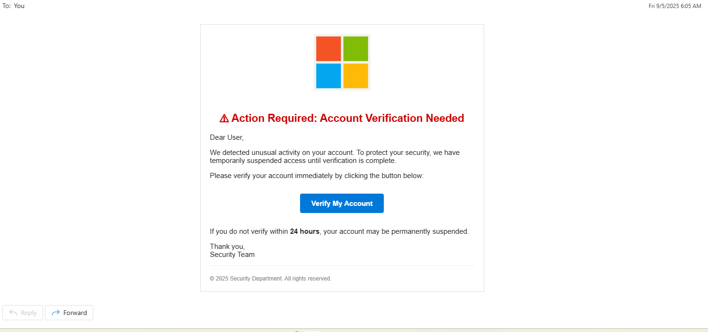
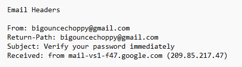
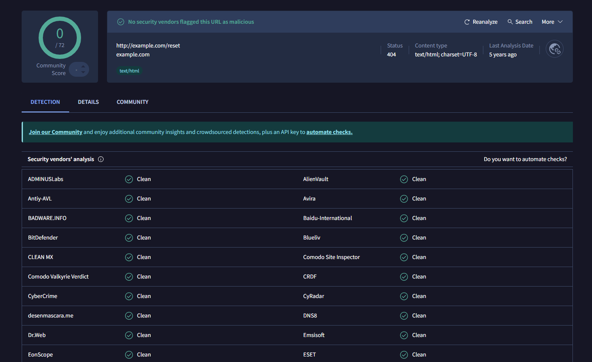
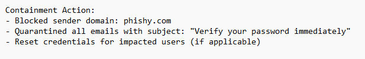

# Phishing Incident Response Playbook (Microsoft Brand Spoofing)

## 1. Purpose
Standardized workflow to detect, analyze, contain, and recover from **phishing email attacks**.  
Audience: Tier 1–2 SOC analysts, with escalation to Tier 3 as required.

---

## 2. Scope
- **Target System:** Outlook / O365 (email)  
- **Attack Vector:** Phishing email impersonating Microsoft (credential-harvesting lure)  
- **Log Sources:** Email headers, O365/OXG/SEG, VirusTotal/sandbox, SIEM (Splunk/O365), user reports  
- **Potential Impact:** Credential theft, mailbox persistence (rules/forwarding), OAuth token abuse, account takeover

---

## 3. Detection

### 3.1 Primary Indicators
- Sender domain mismatch (Gmail sender spoofing Microsoft)  
- **Urgent subject:** “Verify your password immediately”  
- **Generic greeting:** “Dear user”  
- Spoofed Microsoft logo in body  
- Embedded link → **non-Microsoft** domain (`http://example.com/reset`), later 404 (short-lived infra)

### 3.2 Evidence (Screenshots)
- **Phishing email in inbox:**  
  
- **Header analysis (redacted):**  
    
  *Key findings:* Return-Path = Gmail; SPF/DKIM may pass, **DMARC alignment fails**.
- **Sandbox/VT report:**  
    
  *Result:* Non-Microsoft domain; later returns 404; still treated as malicious in context.

---

## 4. Analyst Decision Aid (Tier-1 Flow)

```mermaid
flowchart TD
  A[User reports suspicious email] --> B{Sender/Return-Path mismatch?}
  B -- Yes --> C[Check subject/body: urgency, generic greeting, spoofed logo]
  B -- No --> D[Run SPF/DKIM/DMARC alignment]
  D --> E{DMARC aligned?}
  E -- No --> C
  E -- Yes --> F[Sandbox URL/attachment]
  C --> G{Credential-harvest indicators present?}
  F --> G
  G -- Yes --> H[Escalate to Tier 2 and contain]
  G -- No --> I[Close as benign & educate user]
  H --> J[Quarantine messages; block sender/domain]
  J --> K[Identify affected users; reset credentials]
  K --> L[Revoke OAuth tokens; enforce MFA; check inbox rules]
  L --> M[Notify users; document ticket; record metrics]
  ```
## 5. Containment
- Block sender/domain/IPs at the email gateway.  
- Quarantine emails matching indicators (subject + sender + URL).  
- For any users who clicked/entered creds: reset credentials immediately.  
- Disable suspicious OAuth app grants/tokens tied to affected accounts.  

*Screenshot:*  


---

## 6. Recovery (Expanded Validation)
- **MFA status:** Enforce/verify MFA on affected users.  
- **Mailbox rules:** Check and remove auto-forwarding/inbox rules used for persistence.  
- **OAuth tokens:** Revoke OAuth grants/refresh tokens and invalidate sessions.  
- **Inbox cleanup:** Validate quarantined emails are fully removed from all mailboxes.  
- **Monitoring:** Watch for repeat deliveries or look-alike senders/domains.  

---

## 7. Timeline & Escalation (Example from this incident)

**Timeline**  
- 08:17 – First phishing email delivered  
- 09:02 – First user report submitted  
- 09:10 – SOC investigation began (Tier 1)  
- 10:00 – Containment: gateway domain block + global quarantine  
- 10:45 – Recovery: credential reset; inbox cleanup; OAuth/MFA checks  
- 11:30 – Closure: users notified; post-incident review captured  

**Escalation Path**  
- **Tier 1:** Triage user report(s), header inspection, quick sandbox, initial classification  
- **Tier 2:** Confirm IOCs, execute containment, run recovery validation (MFA, rules, OAuth)  
- **Tier 3 (if needed):** Forensics, broader hunt, infra takedown coordination  

---

## 8. User Communication (Copy-Paste Template)

**Subject:** Security Notice – Phishing Email Reported  

Dear Team,  

A phishing email impersonating Microsoft with the subject **“Verify your password immediately”** was identified in our environment. We have contained the incident and removed the malicious messages.  

If you interacted with this email (clicked the link or entered credentials), please contact **IT Security** immediately.  

**Remember:**  
- Do not click links or open attachments from unexpected emails.  
- Report suspicious messages using the **Report Message** button in Outlook.  

Thank you for your vigilance,  
**IT Security Team**  

---

## 9. Metrics (Track Every Time)
- **MTTD (Mean Time to Detect):** ~45 minutes (first delivery → first report/triage)  
- **MTTR (Mean Time to Respond):** ~2.5 hours (first triage → closure)  
- **Emails sent/delivered:** 24 / 19  
- **User reporting rate:** 4 reporters / 19 delivered = **21%**  
- **Users who clicked:** 1  
- **Users who entered credentials:** 1 (reset immediately; no evidence of compromise)  

> Maintain these metrics per incident to show trend improvements (e.g., rising reporting rate, falling MTTR).  

---

## 10. Lessons Learned (Actionable)

**Technical**  
- SPF/DKIM are not sufficient; implement **DMARC enforcement** with monitoring.  
- Expand SIEM rules for combined signals: urgency + generic greeting + brand keywords.  

**User Awareness**  
- Emphasize “urgency + generic greeting” as red flags in training.  
- Continue quarterly phishing simulations to boost reporting rate.  

**Process**  
- Make OAuth/token revocation and mailbox rule checks standard in recovery.  
- Add proactive hunts for similar campaigns (mail, proxy, VT pivot on domains).  

---

## 11. SOC Ticket

**Incident ID:** SOC-2025-09-05-001  
**Type:** Phishing – Brand Spoofing (Microsoft)  
**Severity:** Medium **Status:** Closed  
**Opened:** 2025-09-05 09:10 (America/New_York) **Closed:** 2025-09-05 11:30  
**Handler:** Jacob Taylor (Tier 1 SOC Analyst)  

**Summary**  
A phishing campaign impersonating Microsoft used an urgent subject (“Verify your password immediately”) and linked to a non-Microsoft domain (`http://example.com/reset`, later 404). Internal users were targeted with credential-harvesting tactics.  

**Indicators**  
- Sender: `bigouncechoppy@gmail.com`  
- Return-Path: Gmail (not Microsoft)  
- Subject: “Verify your password immediately”  
- URL: `http://example.com/reset` (expired but suspicious)  
- Body Traits: Generic greeting; spoofed Microsoft logo  

**Timeline**  
08:17 delivered → 09:02 reported → 09:10 triage → 10:00 containment → 10:45 recovery → 11:30 closed  
**MTTD:** ~45m **MTTR:** ~2.5h  

**Impact**  
- Total sent/delivered: 24 / 19  
- Reported: 4  
- Clicked: 1  
- Entered credentials: 1 (immediately reset; no unauthorized access observed)  

**Containment Actions**  
- Gateway domain block; quarantine of matching emails  
- Credentials reset for impacted user  
- Verified no malicious inbox rules/auto-forwarding  
- No suspicious OAuth grants detected  

**Recovery Actions**  
- Notified all 19 recipients with advisory  
- Confirmed quarantine/removal across inboxes  
- Reviewed login attempts for affected user (no unauthorized access)  
- Verified **MFA** status; revoked tokens/sessions where applicable  

**Final Status:** Incident contained; no confirmed compromise.  

---

## 12. Executive Summary (Leadership)

On **September 5, 2025**, the SOC investigated a phishing campaign impersonating Microsoft with the subject line *“Verify your password immediately.”* The attack targeted 24 users, of which 19 received the message. One user clicked the link and entered credentials. Immediate containment included blocking the sender domain, quarantining all matching emails, and resetting the impacted user’s credentials. Recovery actions included inbox cleanup, verification of mailbox rules, and user notifications.

The incident was contained with no evidence of compromise beyond the single credential reset. **Business impact was minimal**, and no systems or sensitive data were breached. The quick reporting by four employees reduced the time-to-detection, demonstrating the effectiveness of user awareness training. Lessons learned highlight the need for **DMARC enforcement** and continuous phishing awareness. This incident reinforces the SOC’s ability to detect, contain, and remediate credential-harvesting attempts while providing assurance to leadership that business risk was minimized and response procedures are effective.

---

## 13. References
- [NIST 800-61: Computer Security Incident Handling Guide](https://nvlpubs.nist.gov/nistpubs/SpecialPublications/NIST.SP.800-61r2.pdf)  
- [CISA Phishing Guidance](https://www.cisa.gov/news-events/news/avoiding-social-engineering-and-phishing-attacks)  
- [Microsoft Security Documentation – Phishing Protection](https://learn.microsoft.com/en-us/microsoft-365/security/office-365-security/anti-phishing-protection)  
- [VirusTotal Documentation](https://support.virustotal.com/hc/en-us)  
