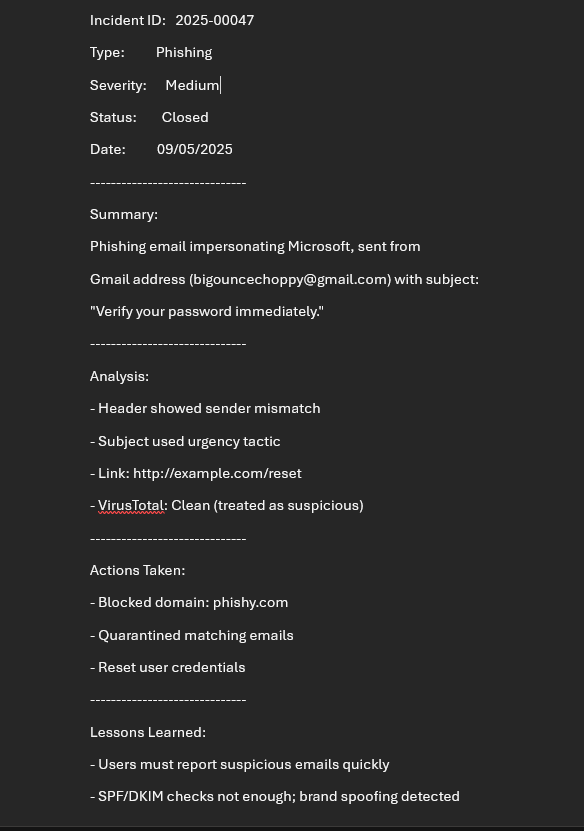

# Phishing Incident Response Playbook

## 1. Purpose
This playbook provides standardized steps for detecting, analyzing, containing, and recovering from **phishing email attacks**.  
It is intended for Tier 1–2 SOC analysts monitoring enterprise email platforms (e.g., Outlook, Gmail, O365).

---

## 2. Scope
- **Target System:** Outlook (Email Platform)  
- **Attack Vector:** Phishing email impersonating Microsoft (account verification lure)  
- **Log Sources:** Email headers, sandbox analysis, user reports  
- **Impact:** Credential theft, potential account compromise, brand spoofing  

---

## 3. Detection

### 3.1 Indicators
- Email claims to be from a trusted brand (Microsoft), but sender domain does not match.  
- Urgent subject line: *"Verify your password immediately"*.  
- Embedded link (`http://example.com/reset`) pointing to non-Microsoft domain.  

### 3.2 Evidence

**Phishing email received in inbox (impersonating Microsoft):**  

**Header analysis (redacted for clarity):**  

  

Key Findings:  
- Sender domain: `bigouncechoppy@gmail.com`  
- Return-Path matches Gmail, not Microsoft.  
- Subject uses urgency tactic.  
- Message relayed via Google mail servers, not Microsoft.  

**Sandbox analysis of suspicious link (VirusTotal):**  

  

Result:  
- URL: `http://example.com/reset`  
- 0/72 vendors flagged as malicious.  
- Treated as suspicious due to impersonation context.  

---

## 4. Containment

SOC containment steps:  

- Blocked sender domain (`phishy.com`)  
- Quarantined all emails with subject *"Verify your password immediately"*  
- Reset impacted user credentials  

---

## 5. Recovery

- Notify users who received the phishing email.  
- Provide security awareness reminder (don’t click links, report phishing).  
- Validate that quarantined emails are removed from inboxes.  
- Confirm no compromised accounts (review login attempts for exposed users).  

---

## 6. Lessons Learned

- Phishing detection must go beyond SPF/DKIM checks — brand spoofing is still possible.  
- Subject line urgency is a common phishing tactic.  
- Users should report suspicious emails immediately.  
- Continuous awareness training reduces click rates.  

---

## 7. References

- [NIST 800-61: Computer Security Incident Handling Guide](https://nvlpubs.nist.gov/nistpubs/SpecialPublications/NIST.SP.800-61r2.pdf)  
- [CISA Phishing Guidance](https://www.cisa.gov/news-events/news/avoiding-social-engineering-and-phishing-attacks)  
- [VirusTotal Documentation](https://support.virustotal.com/hc/en-us)  

---

## 8. SOC Ticket

Final SOC ticket summarizing the incident:  

