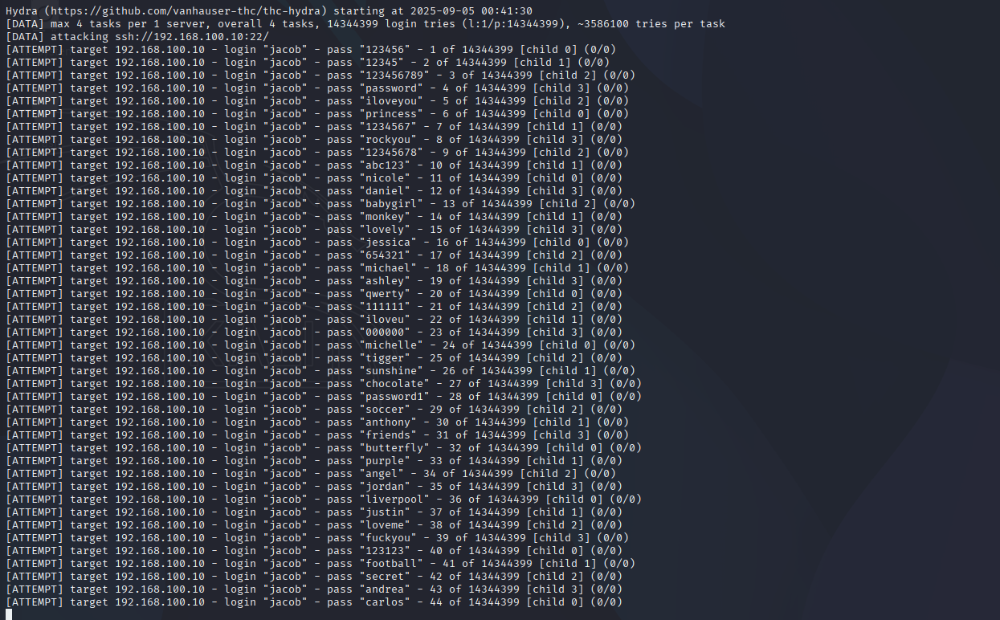
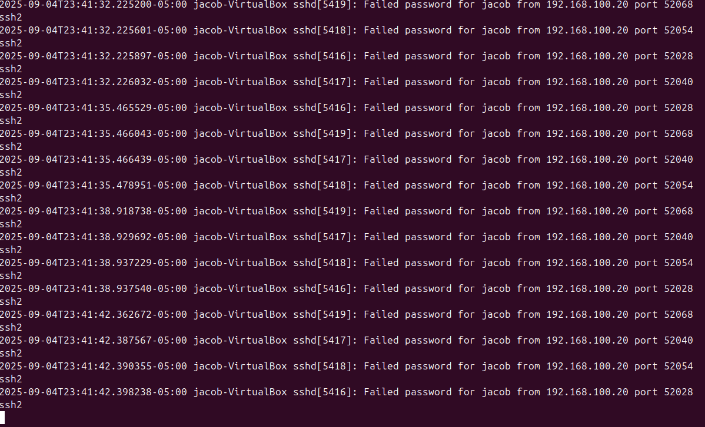
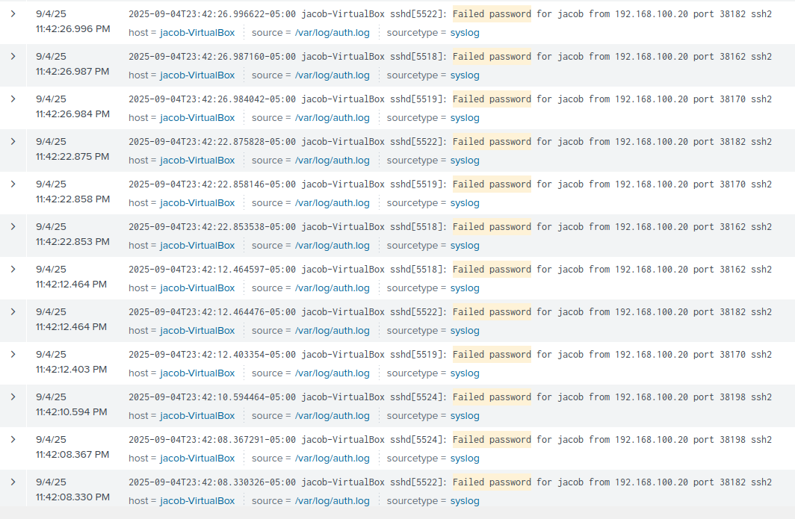
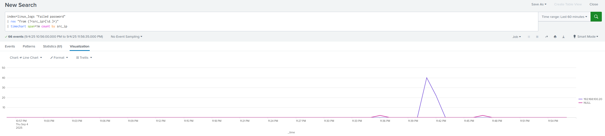
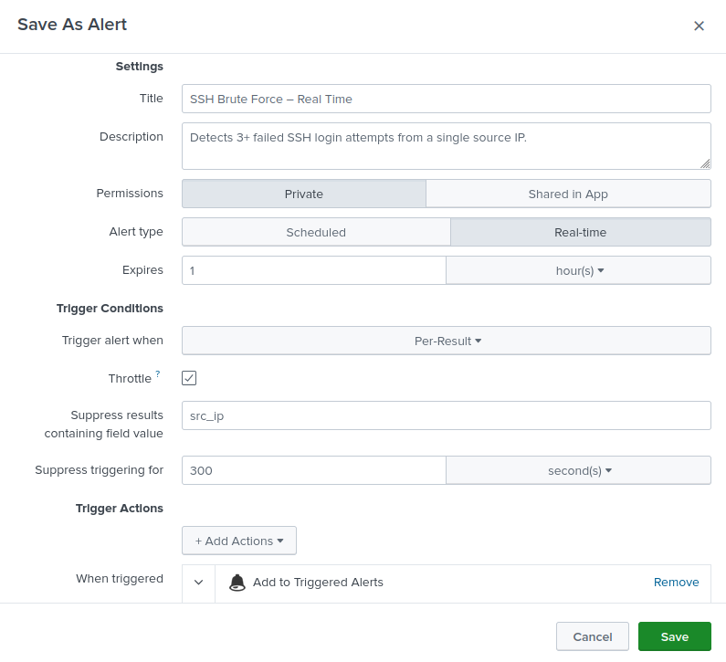
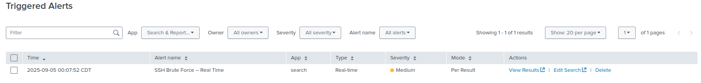
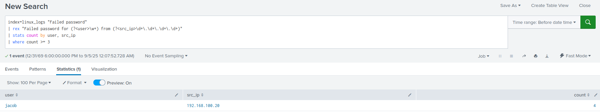
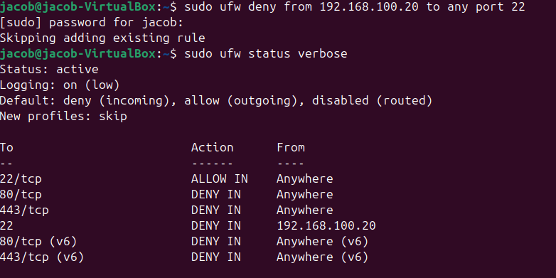

# SSH Brute Force Incident Response Playbook

## 1. Purpose
This playbook provides standardized detection, analysis, containment, and recovery steps for handling **SSH brute force attacks**.  
It is intended for Tier 1–2 SOC analysts monitoring Linux servers with Splunk Enterprise.

---

## 2. Scope
- **Target System:** Ubuntu Server (192.168.100.10) running OpenSSH and Splunk Enterprise  
- **Attacker System:** Kali Linux (192.168.100.20) using Hydra for brute force attempts  
- **Log Source:** `/var/log/auth.log` forwarded into Splunk (`index=linux_logs`)  
- **Potential Impact:** Repeated failed login attempts may lead to account compromise if successful  

---

## 3. Detection

### 3.1 Indicators
- Multiple consecutive **"Failed password"** messages in `/var/log/auth.log`  
- Spike in failed SSH login attempts from a single source IP  
- Splunk alert triggering on repeated login failures  

### 3.2 Evidence (Screenshots)
- **Hydra brute force activity (attacker 192.168.100.20):**  
  
- **Failed SSH login attempts recorded in `/var/log/auth.log`:**  
  
- **Raw Splunk events showing failed login activity:**  
  
- **Aggregated failures by user and source IP (Splunk search):**  
  ```spl
  index=linux_logs "Failed password"
  | rex "Failed password for (?<user>\w+) from (?<src_ip>\d+\.\d+\.\d+\.\d+)"
  | stats count by user, src_ip
  ```
## Visualization of Brute Force Attempts Over Time



---

## 4. Analyst Decision Aid (Tier-1 Flow)

```mermaid
flowchart TD
  A[Multiple SSH failed logins detected] --> B{≥10 failures in 5 min from 1 IP?}
  B -- Yes --> C[Trigger Splunk alert; validate source IP]
  B -- No --> D[Continue monitoring; no action]
  C --> E{Source IP external/untrusted?}
  E -- Yes --> F[Escalate to Tier 2; block via UFW]
  E -- No --> G[Check if false positive (internal admin?)]
  G -- Yes --> H[Whitelist and document]
  G -- No --> F
  F --> I[Document ticket; notify system owner]
  ```
## 5. Alerting

A **real-time Splunk alert** was created to automatically trigger when **≥10 failed SSH login attempts in 5 minutes** are detected from a single source IP.  
*(Note: testing used ≥3 to simulate attacks faster.)*

- **Alert configuration:**  
  

- **Triggered Alerts list confirming detection:**  
  

- **Detailed alert results (attacker IP and count):**  
  

---

## 6. Containment

Block the attacker IP address using **UFW**:

```bash
sudo ufw deny from 192.168.100.20 to any port 22
sudo ufw status numbered
```
**Firewall rule blocking attacker IP:**  


## 7. Recovery

- Review system logs for any **successful SSH logins** from suspicious IPs.  
- Enforce security hardening:  
  - Require **key-based authentication**  
  - Disable **password-based SSH logins**  
  - Restrict SSH access to **trusted IP ranges only**  

---

## 8. User Communication (System Owner Notification)

**Subject:** Security Notice – SSH Brute Force Attempt Blocked  

Hello [System Owner],  

The SOC detected and blocked an SSH brute force attack targeting your server (**192.168.100.10**) from source IP **192.168.100.20** on **August 31, 2025**. Over 100 failed login attempts were observed in a short time window.  

**Actions Taken:**  
- Attacker IP blocked at the firewall (UFW)  
- Verified no successful logins occurred  
- Confirmed system remained operational  

**Recommended Next Steps:**  
- Ensure SSH is configured for **key-based authentication only**  
- Disable password-based SSH logins  
- Restrict SSH access to **trusted IP ranges**  

Please reach out to the SOC team if you have questions or notice unusual activity on this server.  

— IT Security Team 

---

## 9. Timeline & Escalation (Example from this incident)

**Timeline**  
- 01:00 – Hydra brute force launched from Kali (192.168.100.20)  
- 01:02 – Splunk detects failed login spike in `/var/log/auth.log`  
- 01:05 – Splunk alert triggers on threshold exceeded  
- 01:07 – Tier 1 validates logs and confirms brute force attempt  
- 01:10 – Containment: UFW block placed on attacker IP  
- 01:15 – Incident closed; monitoring continues  

**Escalation Path**  
- **Tier 1:** Responds to Splunk alert, confirms log source and IP  
- **Tier 2:** Blocks attacker IP, validates recovery actions, checks for false positives  
- **Tier 3 (if needed):** Forensics if compromise suspected (credential theft, lateral movement)  

---

## 10. Metrics
- **MTTD (Mean Time to Detect):** ~2 minutes (log ingestion → Splunk alert)  
- **MTTR (Mean Time to Respond):** ~10 minutes (alert → IP blocked)  
- **Total Failed Attempts:** >100 in test window (Hydra)  
- **Impacted Users:** None (brute force attempts failed)  

---

## 11. Lessons Learned
- **Detection tuning:** Testing used ≥3 attempts; production should use ≥10 attempts in 5 minutes.  
- **Alert noise control:** Real-time alerts should use **throttling** (suppress by `src_ip` for 300s).  
- **Hardening:** SSH should require keys, not passwords. Disable password auth. Restrict SSH access to trusted IP ranges.  
- **Proactive monitoring:** Build dashboards to track spikes in SSH failures over time for trend analysis.  

---

## 12. Knowledge Base Entry

**Incident Name:** SSH Brute Force – August 31, 2025  
**Key Indicators:** Multiple failed SSH logins in `/var/log/auth.log` (>100 in minutes), Splunk alert triggered on ≥10 failures in 5m  
**Actions That Worked:** Block attacker IP via UFW, verify no successful logins, confirm system operations  
**Lessons Learned (Quick Reference):** Tune thresholds, enable throttling, enforce key-based SSH authentication  
**Reference Ticket:** SOC-2025-08-31-001

---

## 13. SOC Ticket

**Incident ID:** SOC-2025-08-31-001  
**Type:** SSH Brute Force  
**Severity:** Medium **Status:** Closed  
**Opened:** 2025-08-31 01:02 **Closed:** 2025-08-31 01:15  
**Handler:** Jacob Taylor (Tier 1 SOC Analyst)  

**Summary**  
Splunk detected repeated failed SSH login attempts from **192.168.100.20 (Kali Linux/Hydra)** targeting **192.168.100.10 (Ubuntu Server)**. Over 100 failed attempts were logged within minutes.  

**Indicators**  
- Source IP: 192.168.100.20  
- Destination IP: 192.168.100.10  
- Log entries: Multiple “Failed password” events in `/var/log/auth.log`  

**Timeline**  
01:00 attack → 01:02 detection → 01:05 alert → 01:10 containment → 01:15 closure  
**MTTD:** ~2m **MTTR:** ~10m  

**Impact**  
- No accounts compromised  
- System remained operational  
- Brute force attempt stopped at firewall  

**Containment Actions**  
- Blocked attacker IP via UFW  
- Confirmed block active and persistent  

**Recovery Actions**  
- Verified no successful logins from attacker IP  
- Reviewed logs for anomalies  
- Recommended SSH hardening (keys only, password login disabled)  

**Final Status:** Incident contained; no compromise confirmed.  

---

## 14. Executive Summary (Leadership)

On **August 31, 2025**, the SOC investigated an SSH brute force attack targeting **192.168.100.10 (Ubuntu server)** from **192.168.100.20 (Kali Linux/Hydra)**. Over 100 failed login attempts were detected within minutes in `/var/log/auth.log`, triggering a Splunk alert.  

Immediate containment included blocking the attacker IP via UFW and validating that no successful logins occurred. Recovery actions confirmed normal system operations and recommended hardening steps such as enforcing key-based authentication and disabling password-based SSH logins.  

The incident was contained with no evidence of compromise. **Business impact was minimal**, and no systems or sensitive data were breached. Metrics show a **Mean Time to Detect of ~2 minutes** and **Mean Time to Respond of ~10 minutes**, demonstrating the SOC’s ability to quickly detect and stop brute force attempts before credentials are compromised. Lessons learned highlight the importance of detection tuning, throttling alerts to reduce noise, and enforcing SSH best practices across all systems.
  

---

## 15. References
- [NIST 800-61: Computer Security Incident Handling Guide](https://nvlpubs.nist.gov/nistpubs/SpecialPublications/NIST.SP.800-61r2.pdf)  
- [Splunk Documentation: Create Real-Time Alerts](https://docs.splunk.com/Documentation/Splunk/latest/Alert/Createralerts)  
- [UFW Documentation: Uncomplicated Firewall](https://help.ubuntu.com/community/UFW)  

