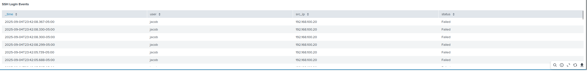

# SSH Brute Force Incident Response Playbook

## 1. Purpose
This playbook provides standardized detection, analysis, containment, and recovery steps for handling **SSH brute force attacks**.  
It is intended for Tier 1–2 SOC analysts monitoring Linux servers with Splunk Enterprise.

---

## 2. Scope
- **Target System:** Ubuntu Server (192.168.100.10) running OpenSSH and Splunk Enterprise  
- **Attacker System:** Kali Linux (192.168.100.20) using Hydra for brute force attempts  
- **Log Source:** `/var/log/auth.log` forwarded into Splunk (`index=linux_logs`)  
- **Impact:** Repeated failed login attempts may lead to account compromise if successful

---

## 3. Detection

### 3.1 Indicators
- Multiple consecutive **"Failed password"** messages in `/var/log/auth.log`  
- Spike in failed SSH login attempts from a single source IP  
- Splunk alert triggering on repeated login failures  

### 3.2 Evidence

**Hydra brute force activity from attacker (192.168.100.20):**


**Failed SSH login attempts recorded in `/var/log/auth.log`:**


**Raw Splunk events showing failed login activity:**


**Aggregated failures by user and source IP:**

```spl
index=linux_logs "Failed password"
| rex "Failed password for (?<user>\w+) from (?<src_ip>\d+\.\d+\.\d+\.\d+)"
| stats count by user, src_ip
```


**Visualization of brute force attempts over time:**


## 4. Alerting

A real-time Splunk alert was created to automatically trigger when **≥3 failed SSH login attempts** are detected from a single source IP.  
*(Note: threshold lowered for testing; production should use ≥10 failures in 5 minutes.)*

**Alert configuration:**


**Triggered Alerts list confirming detection:**


**Detailed alert results (attacker IP and count):**


---

## 5. Containment

Block the attacker IP address using UFW:

```bash
sudo ufw deny from 192.168.100.20 to any port 22
sudo ufw status numbered
```

**Firewall rule blocking attacker IP:**


## 6. Recovery

If a legitimate user is mistakenly blocked (false positive), remove the firewall rule:

```bash
sudo ufw delete <rule_number>
```

## 7. Lessons Learned

- Thresholds must balance sensitivity with noise reduction  
  *(testing used ≥3; production should use ≥10 in 5 minutes).*  
- Real-time alerts should include **throttling** (e.g., suppress by `src_ip` for **300s**) to prevent excessive notifications.  
- Long-term hardening steps:  
  - Enforce **key-based authentication**  
  - Disable **password logins** for SSH  
  - Limit SSH access to **trusted IP ranges**  

---

## 8. References

- [NIST 800-61: Computer Security Incident Handling Guide](https://nvlpubs.nist.gov/nistpubs/SpecialPublications/NIST.SP.800-61r2.pdf)  
- [Splunk Documentation: Create Real-Time Alerts](https://docs.splunk.com/Documentation/Splunk/latest/Alert/Createralerts)  
- [UFW Documentation: Uncomplicated Firewall](https://help.ubuntu.com/community/UFW)  

